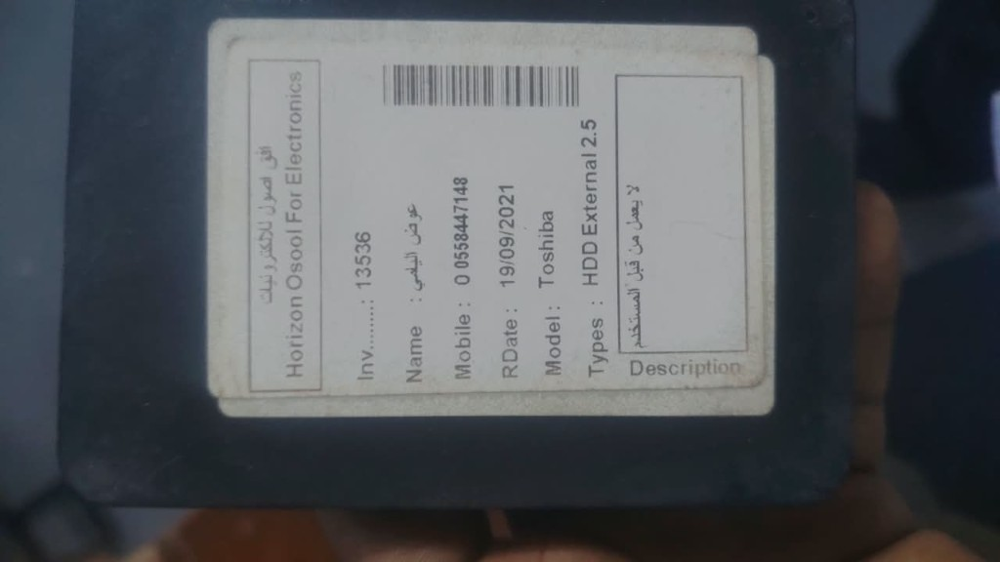
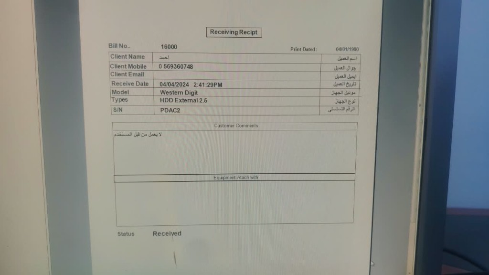

# تطويرات 01 Data Recovery

ملاحظات من اجتماع واتساب 22/08/2026 + توضيح مسار العميل.  
هالملف مرجع للتطوير الجاي — مو تنفيذ.

---

## مسار العميل (الأساس)

هيك بتمشي العملية العادية:

1. **العميل بيجي** ومعه قطعة بدو يصلحها (هارد أو غيرو).
2. **بقول المشكلة** — هي القطعة فيها مشكلة — ومنكتب يلي قالو، بنصّه.
3. **منفحص** ومنعطيه سعر.
4. **إذا وافق** مننتقل للمرحلة التالية ومنحل المشكلة.
5. **بس يتصلح** بصير `done` / `finished`، ومنخبر العميل إنو فيك تستلم.

```
عميل جاي مع قطعة
        ↓
تسجيل: اسم + تليفون + الموديل + نوع القطعة + المشكلة
        ↓
طباعة ستيكر على القطعة + سند استلام للعميل
        ↓
فحص + إعطاء سعر
        ↓
وافق؟ ── لا ──→ wait_client (بفكّر / بشوف الشركة)
        │
       نعم = agree
        ↓
إصلاح (pending → in_progress)
        ↓
done / finished
        ↓
تبليغ العميل: جاهز للاستلام
```

---

## المدخلات (ثابتة، ما بتتغير حسب الحالة)

وقت الاستلام، الموظف يكتب نفس الحقول لكل عملية:

| الحقل | ستيكر | سند العميل | ملاحظات |
| --- | --- | --- | --- |
| رقم الفاتورة / Bill No / Inv | نعم | نعم | النظام يولّده |
| اسم العميل | نعم | نعم | إجباري |
| رقم التليفون / الجوال | نعم | نعم | إجباري |
| الإيميل | لا | نعم | اختياري — ناقص حالياً |
| تاريخ الاستلام | نعم | نعم | تلقائي |
| تاريخ الطباعة | لا | نعم | وقت طباعة السند |
| الموديل / الماركة | نعم | نعم | مثال: Western Digital — ناقص حالياً |
| نوع القطعة | نعم | نعم | مثال: HDD External 2.5 |
| الرقم التسلسلي S/N | لا | نعم | ناقص حالياً |
| المشكلة / Customer Comments | نعم Description | نعم | نص حر، كلام العميل |
| الملحقات / Equipment Attach with | لا | نعم | كيبل، علبة… — ناقص حالياً |
| الباركود | نعم | لا | على الستيكر فقط |
| الحالة Status | لا | نعم | وقت الاستلام: `Received` |

السعر والتقرير بينضافوا **بعد الفحص**، مو على الستيكر ولا سند الاستلام.

---

## المراحل بالتفصيل

### 1. استلام + مطبوعات

العميل جاي، منسمع المشكلة، منكتبها، منسجّل بياناته.

بعد الحفظ بتطلع مطبوعين:

| المطبوع | لمين | وين بيروح |
| --- | --- | --- |
| ستيكر | الورشة | ينلزق فوق القطعة المستلمة |
| سند الاستلام (Receiving Receipt) | العميل | ياخده معه كإثبات استلام |

حالة البداية: `received`

الباركود اللي على الستيكر هو اللي منمسحه بعدين لفتح العملية — مو باركود المصنع.

### ستيكر الطباعة

مرجع الشكل الحالي (ورشة ثانية، نفس الفكرة):



الستيكر فيها:

- اسم الشركة (عندنا: 01 Data Recovery)
- باركود
- Inv / Name / Mobile / RDate / Model / Types
- مربع Description = المشكلة مثل ما قال العميل

مثال من الصورة:

- Inv: `13536`
- Name: عوض اليافعي
- Mobile: `0558447148`
- RDate: `19/09/2021`
- Model: `Toshiba`
- Types: `HDD External 2.5`
- Description: لا يعمل من قبل المستخدم

وقت التنفيذ: بعد إنشاء العملية يرجع ملف طباعة حراري/PDF بهالحقول، والموظف يلزقها على القطعة.

### سند الاستلام (للعميل)

هيدا الورقة اللي يستلمها العميل بعد ما يسلّم القطعة. إثبات إن القطعة عندنا.

مرجع الشكل الحالي:



العنوان: **Receiving Receipt**

الحقول من المثال:

| الحقل إنجليزي | الحقل عربي | مثال |
| --- | --- | --- |
| Bill No | رقم السند | `16000` |
| Print Dated | تاريخ الطباعة | وقت الطباعة |
| Client Name | اسم العميل | احمد |
| Client Mobile | جوال العميل | `0569360748` |
| Client Email | ايميل العميل | اختياري |
| Receive Date | تاريخ الاستلام | `04/04/2024 2:41:29PM` |
| Model | موديل الجهاز | Western Digital |
| Types | نوع الجهاز | HDD External 2.5 |
| S/N | الرقم التسلسلي | `PDAC2` |
| Customer Comments | ملاحظات العميل | لا يعمل من قبل المستخدم |
| Equipment Attach with | الملحقات المرافقة | كيبل، شنطة… أو فاضي |
| Status | الحالة | `Received` |

السند ثنائي اللغة (إنجليزي يسار / عربي يمين) مثل المثال.

وقت التنفيذ: بعد إنشاء العملية يرجع PDF سند الاستلام للطباعة أو للمشاركة (واتساب)، غير ستيكر القطعة.

### 2. فحص + سعر

بعد الفحص منعطيه سعر.

- السعر جزء أساسي من المسار، مو اختياري.
- إذا شركته طلبت عرض سعر رسمي، منعمل عرض ونبعتو (إضافة على نفس العملية).

بعد الفحص كمان ممكن ينكتب على التقرير:

| القيمة | المعنى |
| --- | --- |
| `no_spare_parts` | مافي قطع غيار |
| `send_out_china` | إرسال للصين |

### 3. قرار الزبون

| القيمة | المعنى | الخطوة التالية |
| --- | --- | --- |
| `agree` | موافق على السعر | منبلش الإصلاح |
| `wait_client` | بفكّر أو بشوف الشركة | ننتظر ردّه |
| `finished` | خلصناه / done | نخبره يستلم |

`finished` و `done` نفس الحالة.

إذا كان `wait_client` ورجع وافق، بتتحول لـ `agree`.

### 4. الإصلاح (فقط بعد `agree`)

منحل المشكلة. إذا في ضغط طلبات أو بحث عن قطع:

| القيمة | المعنى |
| --- | --- |
| `pending` | تحت العمل / بالانتظار |
| `in_progress` | عم نشتغل / نبحث عن قطع |
| `finished` | انتهى الإصلاح |

```
agree → pending → in_progress → finished
```

### 5. تسليم

لما تصير `finished` / `done`:

- منخبر العميل إنو فيك تستلم
- التبليغ جزء من هالمرحلة (واتساب / رسالة من التطبيق لاحقاً)

---

## عرض سعر الشركة

غير السعر الشفهي بعد الفحص:

- الزبون ممكن يطلب عرض سعر مكتوب لشركته
- مو حالة بدال `agree` / `wait_client`
- ينعمل على نفس العملية ويتبعت

تفاصيل الحقول (مبلغ، عملة، صلاحية) لسا مو مقفلة.

---

## شو موجود حالياً وما لازم يبقى

| الحالي | القرار |
| --- | --- |
| `received` | تبقى كاستلام قبل الفحص |
| `finished` | تبقى = done + جاهز للاستلام |
| `completed` | تتشال — صارت نفس `finished` |
| `has_problems` | تتشال — بدالها تقرير القطع / الصين |
| `notes` عام | ينفصل: مشكلة العميل + ملاحظات الفحص |

ناقص وما اتعمل بعد:

- حقل المشكلة (كلام العميل) = Description / Customer Comments
- حقل الموديل / الماركة
- الرقم التسلسلي S/N
- الإيميل (اختياري)
- الملحقات المرافقة (Equipment Attach with)
- توليد باركود الستيكر + طباعته ولزقه على القطعة
- طباعة سند الاستلام للعميل (Receiving Receipt)
- إعطاء سعر بعد الفحص
- تقارير الزبون: `agree` / `wait_client`
- حالات الشغل بعد الموافقة: `pending` / `in_progress`
- علم التقرير: `no_spare_parts` / `send_out_china`
- عرض سعر للشركة
- تبليغ العميل عند `done` إنو يقدر يستلم

---

## مقترح تنفيذ لاحق (بعد التأكيد)

### الحالات

مسار واحد مسطّح أوضح مع القصة:

`received` → فحص + سعر → `wait_client` أو `agree` → `pending` → `in_progress` → `finished`

أو مستويين إذا بدنا نفصل قرار الزبون عن الشغل:

1. `client_report`: `agree` | `wait_client` | `finished`
2. `work_status`: تظهر فقط بعد `agree` → `pending` | `in_progress` | `finished`

### حقول جديدة

- `problem` — كلام العميل (Description / Customer Comments)
- `model` — الماركة / الموديل
- `serial_number` — S/N
- `customer_email` — اختياري
- `attached_equipment` — الملحقات مع القطعة
- `barcode` — يتولّد مع الفاتورة وينطبع على الستيكر
- قالب طباعة ستيكر (حراري أو PDF)
- قالب طباعة سند الاستلام للعميل (PDF ثنائي اللغة)
- `inspection_notes` — ملاحظات الفحص
- `price` — السعر بعد الفحص
- `report_flag` — `none` | `no_spare_parts` | `send_out_china`
- `quote_requested` + بيانات عرض السعر الرسمي
- `ready_notified_at` — وقت ما خبرنا العميل يستلم

---

## أسئلة مفتوحة

1. السعر بعد الفحص: مبلغ واحد يكفي؟
2. عرض سعر الشركة: نفس المبلغ ولا نموذج أطول؟
3. `no_spare_parts` و `send_out_china` خيار واحد ولا ممكن الاثنين؟
4. إذا `wait_client` طوّل، في مهلة؟
5. تبليغ الاستلام: بس علامة بالنظام، ولا إرسال واتساب تلقائي؟
6. طابعة الستيكر: حرارية (زي المثال) ولا A4 عادي؟
7. الباركود: نفس رقم الفاتورة (`13536`) ولا كود مستقل؟
8. سند الاستلام: A4 مثل المثال؟ وإيميل العميل إجباري ولا نتركه فاضي؟
9. رقم السند Bill No هو نفس Inv على الستيكر؟

---

## مصدر القرار

- واتساب 22/08/2026: 3 تقارير (`agree` / `wait client` / `finished`) + عرض سعر للشركة + `no spare parts` / `send out china` + بعد الموافقة `pending` / `in progress` / `finished`
- توضيح لاحق: العميل بيجي مع قطعة → منكتب مشكلته → منفحص ومنعطيه سعر → إذا وافق منصلح → لما يخلص `done` ومنخبره يستلم
- ستيكر الطباعة: بعد الاستلام بتطلع ملصق (Inv, Name, Mobile, RDate, Model, Types, Description + باركود) ومنلزقه فوق القطعة المستلمة
- سند الاستلام: ورقة Receiving Receipt يستلمها العميل (Bill No, الاسم، الجوال، الإيميل، التاريخ، الموديل، النوع، S/N، ملاحظات العميل، الملحقات، Status = Received)
